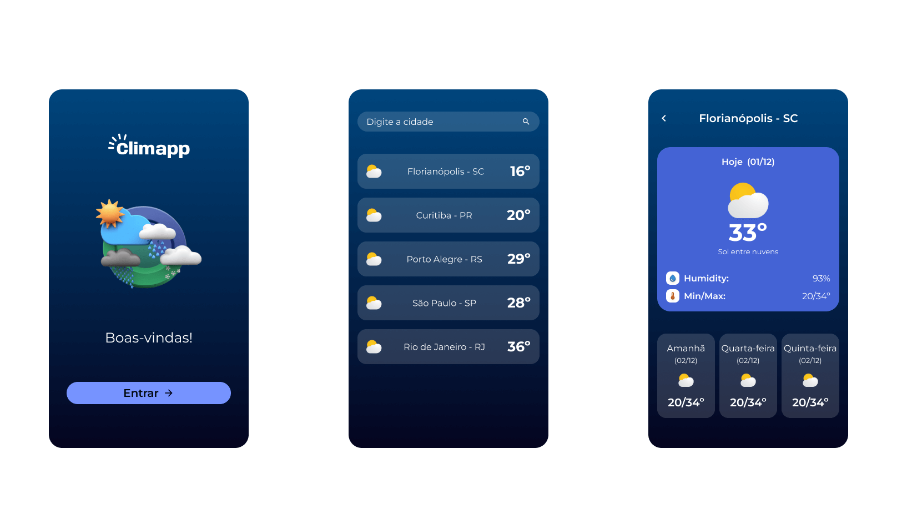

# climapp

Projeto Expo – Aplicativo de Clima em Tempo Real

Este projeto é um aplicativo de clima desenvolvido com Expo e React Native, permitindo que os usuários obtenham informações meteorológicas em tempo real de forma rápida e intuitiva.

## 👥 Confira:

